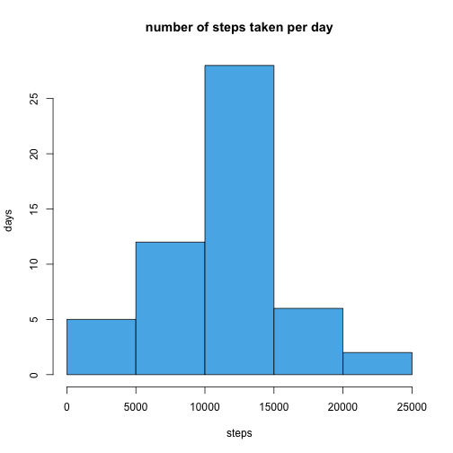
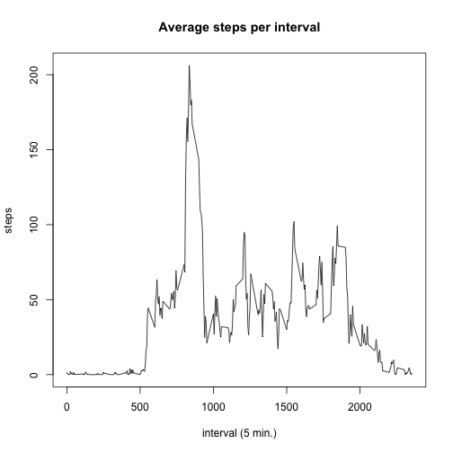
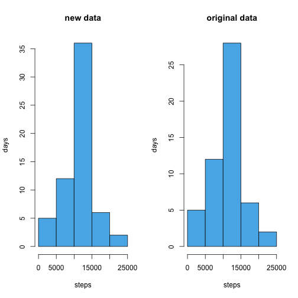
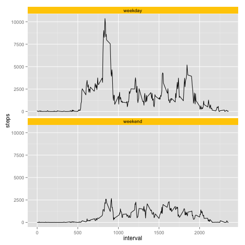

#Peer Assignment 1#

####***author:*** Sonat####
####***date:*** 14 Mar 2015###
####***output:*** html_document###

### Introduction ###

It is now possible to collect a large amount of data about personal movement using activity monitoring devices such as a [Fitbit][1], [Nike Fuelband][2], or [Jawbone Up][3]. These type of devices are part of the “quantified self” movement – a group of enthusiasts who take measurements about themselves regularly to improve their health, to find patterns in their behavior, or because they are tech geeks. But these data remain under-utilized both because the raw data are hard to obtain and there is a lack of statistical methods and software for processing and interpreting the data.

This assignment makes use of data from a personal activity monitoring device. This device collects data at 5 minute intervals through out the day. The data consists of two months of data from an anonymous individual collected during the months of October and November, 2012 and include the number of steps taken in 5 minute intervals each day.

### Data ###

The data for this assignment can be downloaded from the course web site:

- Dataset: [Activity monitoring data][4] [52K]

The variables included in this dataset are:

- **steps:** Number of steps taking in a 5-minute interval (missing values are coded as NA)
- **date:** The date on which the measurement was taken in YYYY-MM-DD format
- **interval:** Identifier for the 5-minute interval in which measurement was taken

The dataset is stored in a comma-separated-value (CSV) file and there are a total of 17,568 observations in this dataset.
Assignment

This assignment will be described in multiple parts. You will need to write a report that answers the questions detailed below. Ultimately, you will need to complete the entire assignment in a single **R markdown** document that can be processed by **knitr** and be transformed into an HTML file.

Throughout your report make sure you always include the code that you used to generate the output you present. When writing code chunks in the R markdown document, always use | echo = TRUE | so that someone else will be able to read the code. **This assignment will be evaluated via peer assessment so it is essential that your peer evaluators be able to review the code for your analysis.**

For the plotting aspects of this assignment, feel free to use any plotting system in R (i.e., base, lattice, ggplot2)

Fork/clone the [GitHub repository created for this assignment][5]. You will submit this assignment by pushing your completed files into your forked repository on GitHub. The assignment submission will consist of the URL to your GitHub repository and the SHA-1 commit ID for your repository state.

NOTE: The GitHub repository also contains the dataset for the assignment so you do not have to download the data separately.

### Loading and preprocessing the data ###

Show any code that is needed to

1. Load the data (i.e. read.csv())

     ***Answer:*** **The following is the code to load data and to transform into data.table (preferred data type):**

```r
library(data.table)
data <- as.data.table(read.csv("activity.csv"))
```

2. Process/transform the data (if necessary) into a format suitable for your analysis

     ***Answer:*** **The following is a sumary of the data and no transformation is needed for now:**

```r
str(data)
```

```
## Classes 'data.table' and 'data.frame':	17568 obs. of  3 variables:
##  $ steps   : int  NA NA NA NA NA NA NA NA NA NA ...
##  $ date    : Factor w/ 61 levels "2012-10-01","2012-10-02",..: 1 1 1 1 1 1 1 1 1 1 ...
##  $ interval: int  0 5 10 15 20 25 30 35 40 45 ...
##  - attr(*, ".internal.selfref")=<externalptr>
```

### What is mean total number of steps taken per day? ###

For this part of the assignment, you can ignore the missing values in the dataset.

1. Calculate the total number of steps taken per day

     ***Answer:*** **The following calculates/displays total number of steps taken per day:**

```r
stepsdays <- data[,c("date","steps"),with=FALSE]
stepsperday <- aggregate(. ~ date,data = stepsdays,FUN=sum)
stepsperday
```

```
##          date steps
## 1  2012-10-02   126
## 2  2012-10-03 11352
## 3  2012-10-04 12116
## 4  2012-10-05 13294
## 5  2012-10-06 15420
## 6  2012-10-07 11015
## 7  2012-10-09 12811
## 8  2012-10-10  9900
## 9  2012-10-11 10304
## 10 2012-10-12 17382
## 11 2012-10-13 12426
## 12 2012-10-14 15098
## 13 2012-10-15 10139
## 14 2012-10-16 15084
## 15 2012-10-17 13452
## 16 2012-10-18 10056
## 17 2012-10-19 11829
## 18 2012-10-20 10395
## 19 2012-10-21  8821
## 20 2012-10-22 13460
## 21 2012-10-23  8918
## 22 2012-10-24  8355
## 23 2012-10-25  2492
## 24 2012-10-26  6778
## 25 2012-10-27 10119
## 26 2012-10-28 11458
## 27 2012-10-29  5018
## 28 2012-10-30  9819
## 29 2012-10-31 15414
## 30 2012-11-02 10600
## 31 2012-11-03 10571
## 32 2012-11-05 10439
## 33 2012-11-06  8334
## 34 2012-11-07 12883
## 35 2012-11-08  3219
## 36 2012-11-11 12608
## 37 2012-11-12 10765
## 38 2012-11-13  7336
## 39 2012-11-15    41
## 40 2012-11-16  5441
## 41 2012-11-17 14339
## 42 2012-11-18 15110
## 43 2012-11-19  8841
## 44 2012-11-20  4472
## 45 2012-11-21 12787
## 46 2012-11-22 20427
## 47 2012-11-23 21194
## 48 2012-11-24 14478
## 49 2012-11-25 11834
## 50 2012-11-26 11162
## 51 2012-11-27 13646
## 52 2012-11-28 10183
## 53 2012-11-29  7047
```

2. If you do not understand the difference between a histogram and a barplot, research the difference between them. Make a histogram of the total number of steps taken each day

     ***Answer:*** **The following defines the difference between historgram and barplot quoted from [stattreck.com:][6]**

> With bar charts, each column represents a group defined by a categorical variable; and with histograms, each column represents a group defined by a quantitative variable.  

     

```r
hist(stepsperday$steps, 
     xlab="steps", 
     ylab="days", 
     main="number of steps taken per day",
     col="#56B4E9")
```

 

3. Calculate and report the mean and median of the total number of steps taken per day

     ***Answer:*** **mean and median of the total number of steps taken per day:**

```r
steps_mean <- mean(stepsperday$steps)
steps_median <- median(stepsperday$steps)
rbind(steps_mean,steps_median)
```

```
##                  [,1]
## steps_mean   10766.19
## steps_median 10765.00
```

### What is the average daily activity pattern? ###

1. Make a time series plot (i.e. type = "l") of the 5-minute interval (x-axis) and the average number of steps taken, averaged across all days (y-axis)

     ***Answer:*** **The following creates a time series plot of interval and the number of steps taken, averaged across all days:**

```r
stepsintervals <- data[,c("interval","steps"),with=FALSE]
stepsperinterval <- as.data.table(aggregate(. ~ interval,data = stepsintervals,FUN=mean))
plot(x=stepsperinterval$interval,
     y=stepsperinterval$steps, 
     type="l",
     main="Average steps per interval", 
     ylab="steps", 
     xlab="interval (5 min.)")
```

 

2. Which 5-minute interval, on average across all the days in the dataset, contains the maximum number of steps?

     ***Answer:*** **The interval with the most number of average steps:**

```r
stepsperinterval[steps==max(stepsperinterval$steps)]
```

```
##    interval    steps
## 1:      835 206.1698
```

### Imputing missing values ###

Note that there are a number of days/intervals where there are missing values (coded as NA). The presence of missing days may introduce bias into some calculations or summaries of the data.

1. Calculate and report the total number of missing values in the dataset (i.e. the total number of rows with NAs)

     ***Answer:*** **Total number of missing values in the row data is:**

```r
sum(!complete.cases(data))
```

```
## [1] 2304
```

2. Devise a strategy for filling in all of the missing values in the dataset. The strategy does not need to be sophisticated. For example, you could use the mean/median for that day, or the mean for that 5-minute interval, etc.

     ***Answer:*** **The average number of steps in per interval is already calculated and stored in the variable stepsperintaval. This data will be used as fill in the missing values, however we need to convert the numeric value of steps into integer:**

```r
stepsperinterval$steps <- as.integer(stepsperinterval$steps)
str(stepsperinterval)
```

```
## Classes 'data.table' and 'data.frame':	288 obs. of  2 variables:
##  $ interval: int  0 5 10 15 20 25 30 35 40 45 ...
##  $ steps   : int  1 0 0 0 0 2 0 0 0 1 ...
##  - attr(*, ".internal.selfref")=<externalptr> 
##  - attr(*, "index")= atomic  
##   ..- attr(*, "steps")= int  9 17 24 25 26 28 29 31 33 34 ...
```

3. Create a new dataset that is equal to the original dataset but with the missing data filled in.

     ***Answer:*** **The following creates a new dataset "newdata" and replaces the NA values with the values from "stepsperinterval" dataset:**

```r
# copy data into newdata
newdata <- data

# Following function can replace NA steps with the mean step for the particular interval:
for (i in 1:nrow(newdata)) {
     if(is.na(newdata$steps[i])) {
          newdata$steps[i] <- stepsperinterval[interval==newdata$interval[i],steps]
     }
} 

# All data is complete now, no NA values in the new dataset:
sum(!complete.cases(newdata))
```

```
## [1] 0
```

     **Original dataset**

```r
str(data)
```

```
## Classes 'data.table' and 'data.frame':	17568 obs. of  3 variables:
##  $ steps   : int  NA NA NA NA NA NA NA NA NA NA ...
##  $ date    : Factor w/ 61 levels "2012-10-01","2012-10-02",..: 1 1 1 1 1 1 1 1 1 1 ...
##  $ interval: int  0 5 10 15 20 25 30 35 40 45 ...
##  - attr(*, ".internal.selfref")=<externalptr>
```
     
     **New dataset**

```r
str(newdata)
```

```
## Classes 'data.table' and 'data.frame':	17568 obs. of  3 variables:
##  $ steps   : int  1 0 0 0 0 2 0 0 0 1 ...
##  $ date    : Factor w/ 61 levels "2012-10-01","2012-10-02",..: 1 1 1 1 1 1 1 1 1 1 ...
##  $ interval: int  0 5 10 15 20 25 30 35 40 45 ...
##  - attr(*, ".internal.selfref")=<externalptr>
```

4. Make a histogram of the total number of steps taken each day and Calculate and report the mean and median total number of steps taken per day. Do these values differ from the estimates from the first part of the assignment? What is the impact of imputing missing data on the estimates of the total daily number of steps?

     ***Answer:*** **The following creates a new historgram using the "newdata" and both the original historgram with the new one side by side for comparison which will show the total daily number of steps for each dataset:**

```r
newstepsdays <- newdata[,c("date","steps"),with=FALSE]
newstepsperday <- aggregate(. ~ date,data = newstepsdays,FUN=sum)
str(newstepsperday)
```

```
## 'data.frame':	61 obs. of  2 variables:
##  $ date : Factor w/ 61 levels "2012-10-01","2012-10-02",..: 1 2 3 4 5 6 7 8 9 10 ...
##  $ steps: int  10641 126 11352 12116 13294 15420 11015 10641 12811 9900 ...
```

```r
par(mfrow=c(1,2))
# creates histrogram of newdata
hist(newstepsperday$steps, 
     xlab="steps", 
     ylab="days", 
     main="new data",
     col="#56B4E9")

# creates histrogram of original data
hist(stepsperday$steps, 
     xlab="steps", 
     ylab="days", 
     main="original data",
     col="#56B4E9")
```

 

```r
# displays mean and median values of original and new data
new_steps_mean <- mean(newstepsperday$steps)
new_steps_median <- median(newstepsperday$steps)
```

     **new data**

```r
rbind(new_steps_mean,new_steps_median)
```

```
##                      [,1]
## new_steps_mean   10749.77
## new_steps_median 10641.00
```

     **original data**

```r
rbind(steps_mean,steps_median)
```

```
##                  [,1]
## steps_mean   10766.19
## steps_median 10765.00
```

### Are there differences in activity patterns between weekdays and weekends? ###

For this part the weekdays() function may be of some help here. Use the dataset with the filled-in missing values for this part.

1. Create a new factor variable in the dataset with two levels – “weekday” and “weekend” indicating whether a given date is a weekday or weekend day.

     ***Answer:*** **The following Converts date from Factor to Date, adds a column for day and populates with "weekday" or "weekend" based on the abreviation of the day, converts this new column into a Factor and displays the result:**


```r
newdata$date <- as.Date(newdata$date)
newdata$day <- ifelse(weekdays(newdata$date, abbreviate = TRUE) %in% c("Sat","Sun"), c("weekend"), c("weekday"))
newdata$day <- as.factor(newdata$day)
str(newdata)
```

```
## Classes 'data.table' and 'data.frame':	17568 obs. of  4 variables:
##  $ steps   : int  1 0 0 0 0 2 0 0 0 1 ...
##  $ date    : Date, format: "2012-10-01" "2012-10-01" ...
##  $ interval: int  0 5 10 15 20 25 30 35 40 45 ...
##  $ day     : Factor w/ 2 levels "weekday","weekend": 1 1 1 1 1 1 1 1 1 1 ...
##  - attr(*, ".internal.selfref")=<externalptr>
```

2. Make a panel plot containing a time series plot (i.e. type = "l") of the 5-minute interval (x-axis) and the average number of steps taken, averaged across all weekday days or weekend days (y-axis). See the README file in the GitHub repository to see an example of what this plot should look like using simulated data.

     ***Answer:*** **The following creates a panel plot showing the difference between steps on weekdays and steps on weekends:**

```r
newstepsdays <- newdata[,c("day","steps","interval"),with=FALSE]
newstepsperday <- aggregate(. ~ day+interval,data = newstepsdays,FUN=sum)

library(ggplot2)
ggplot(newstepsperday, aes(x=interval,y=steps)) + 
     geom_line() +
     facet_wrap( ~ day, ncol=1) +
     theme(strip.background = element_rect(fill="#FFCC00"))
```

 

#End of Peer Assignment 1#

[1]: http://www.fitbit.com/ "Fitbit"
[2]: http://www.nike.com/us/en_us/c/nikeplus-fuelband/ "Nike Fuelband"
[3]: https://jawbone.com/up/ "Jawbone Up"
[4]: https://d396qusza40orc.cloudfront.net/repdata%2Fdata%2Factivity.zip "Activity monitoring data"
[5]: https://github.com/rdpeng/RepData_PeerAssessment1 "GitHub repository created for this assignment"
[6]: http://stattrek.com/statistics/charts/histogram.aspx "stattrek.com"
